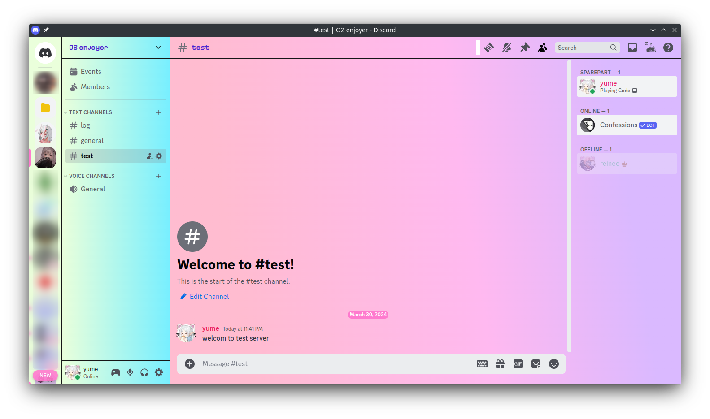

# Needy-streamer-overload-inspired-discord-theme

## 
!!!This is ongoing project!!!

A Discord theme inspired by the visual novel, [NEEDY STREAMER OVERLOAD](https://store.steampowered.com/app/1451940/NEEDY_STREAMER_OVERLOAD) (also known as NEEDY GIRL OVERDOSE).

## Todo/Idea list

- [ ] Dark theme for [ame-profile](https://angelkawaii.com/en/ame-profile/)
- [ ] Add a custom background
- [ ] Add custom icons
- [ ] Add JINE frame border to user popout

## Preview

## Installation

There is no installation guide yet, but you can use [Vencord](https://vencord.dev/) to test this theme. Just copy the code from `themes/index.css` and paste it into the custom CSS box.

## Resources

- [OMGkawaiiAngel](https://angelkawaii.com/)
- [NEEDY STREAMER OVERLOAD WIKI](https://needy-streamer-overload.fandom.com/wiki/NEEDY_STREAMER_OVERLOAD_Wiki)
- [SyndiShanX/Update-Classes](https://github.com/SyndiShanX/Update-Classes)
- [lezzthanthree/Needy-Streamer-Overload](https://github.com/lezzthanthree/Needy-Streamer-Overload)

## Contributing

I need help with [Todo/Idea list](#todoidea-list), but any contributions or suggestions are welcome. Feel free to contribute to this project by forking this repository, making your changes, and submitting a pull request.
