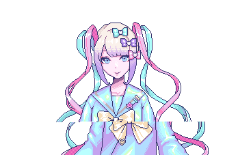
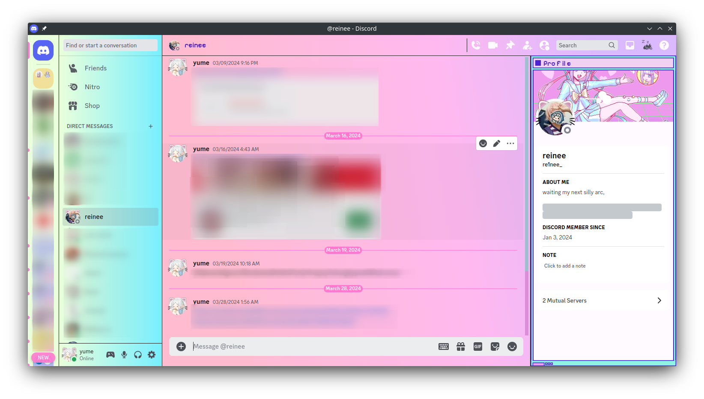
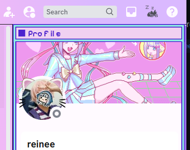
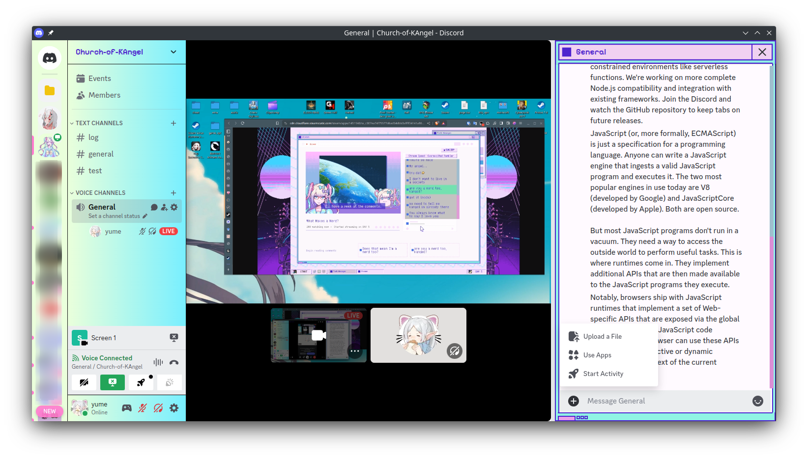

# Needy-streamer-overload-inspired-discord-theme

<div align="center">

</div>

## <div align="center">!!!This is ongoing project!!!</div>

A Discord theme inspired by the visual novel, [NEEDY STREAMER OVERLOAD](https://store.steampowered.com/app/1451940/NEEDY_STREAMER_OVERLOAD) (also known as NEEDY GIRL OVERDOSE). This theme is based on the game's art style and the [OMGkawaiiAngel](https://angelkawaii.com/) website.

## Todo/Idea list

- [ ] Dark theme for [ame-profile](https://angelkawaii.com/en/ame-profile/)
- [ ] Add a custom background
- [ ] Add custom icons
- [ ] Add JINE frame border to user popout
- [x] Minify output CSS

## Preview (some parts are outdated)

The blur part is not part of the theme, it's just for privacy.

| <br>server and user list |
| :----------------------------------------------------------------------: |

| <br>add frame border to DM profile | <br>override animation for non Nitro user (I think this is questionable to remove discord user customization) |
| :--------------------------------------------------------------------------: | -------------------------------------------------------------------------------------------------------------------------------------------------------------------------------- |

| <br>stream chat |
| :--------------------------------------------------------------------: |

## Installation

There is no installation guide yet, but you can use [Vencord](https://vencord.dev/) to test this theme. Copy the code from `output/ame-chan.theme.css` and paste it into the custom CSS box or copy the file into `themes` folder of your vencord installation.

## Development

Install [Bun](https://bun.sh/)(preferred) or [Node.js](https://nodejs.org/) and run the following commands:

```bash
bun install
```

To run the file watcher run this, it will ask for the vencord theme folder:
(if you use linux default vencord installation, just hit enter)

```bash
bun run watch
```

To build the theme run this, the output will be in `output/ame-chan.theme.css`:

```bash
bun run build
```

## Resources

- [OMGkawaiiAngel](https://angelkawaii.com/)
- [NEEDY STREAMER OVERLOAD WIKI](https://needy-streamer-overload.fandom.com/wiki/NEEDY_STREAMER_OVERLOAD_Wiki)
- [SyndiShanX/Update-Classes](https://github.com/SyndiShanX/Update-Classes)
- [lezzthanthree/Needy-Streamer-Overload](https://github.com/lezzthanthree/Needy-Streamer-Overload)

## Contributing

I need help with [Todo/Idea list](#todoidea-list), but any contributions or suggestions are welcome. Feel free to contribute to this project by forking this repository, making your changes, and submitting a pull request. Lastly please don't over do it, this theme is meant to be cute, simple, and user friendly (**don't change too much font or add too much animations, it will be hard to read and use**).
